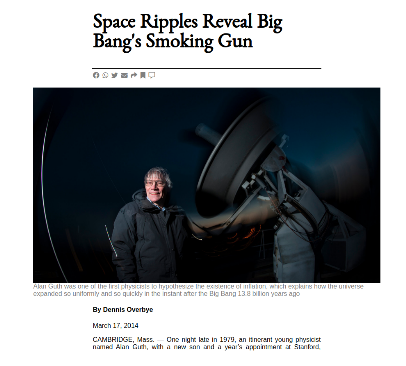

# New York Times Article clone

> The project is a clone of the new york times article page.

This page(in the project) is actually built with some basic tag with html and css.

## Built With

- HTML5 & CSS 3
- No Frameworks
- Some basic HTML tag with Float, Flex, Grid.

## Live Demo

[Live Demo Link](https://mahbubul14.github.io/The-New-York-Times/)

👤 **Mahbub Alam**

- GitHub: [@githubhandle](https://www.linkedin.com/in/mahbubul-alam-20595/)
- Twitter: [@twitterhandle](https://twitter.com/MahbubA10454419)
- LinkedIn: [LinkedIn](https://github.com/mahbubul14/)

## 🤝 Contributing

Contributions, issues, and feature requests are welcome!

Feel free to check the [issues page](https://github.com/mahbubul14/The-New-York-Times/issues).

## Show your support

Give a ⭐️ if you like this project!

## Acknowledgments

- Microverse
- Mentor & Stand up team mates
- Coding partner

## 📝 License

This project is [MIT](./MIT.md) licensed.
